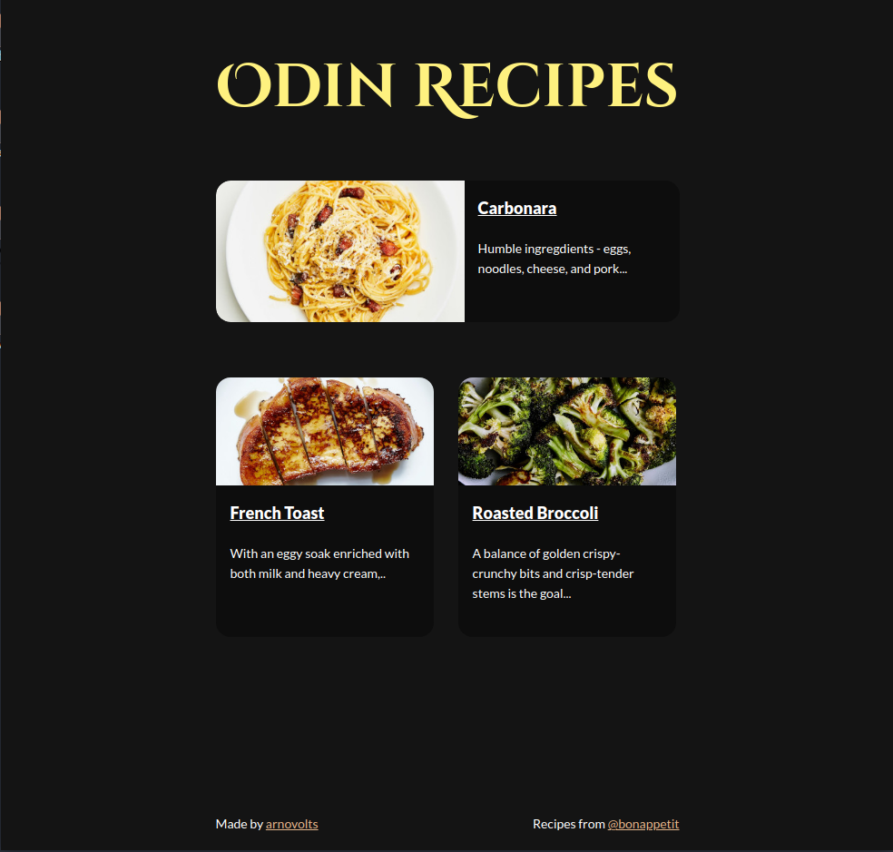

# Introduction
It is a simple website showcasing recipes.
This project is offered by [the odin project](https://www.theodinproject.com/about), in the final section of their HTML Foundations course. 

# Styling
CSS rules have been added to the website. This update was an assignment of [CSS foundation Section](https://www.theodinproject.com/paths/foundations/courses/foundations/lessons/css-foundations#practice).

# What I've Learned
- Working with HTML text elements.
- Working with images and links. 
- Working with basic CSS properties.

You can find me at [@segaullt](https://twitter.com/segfaullt) on twitter. 
